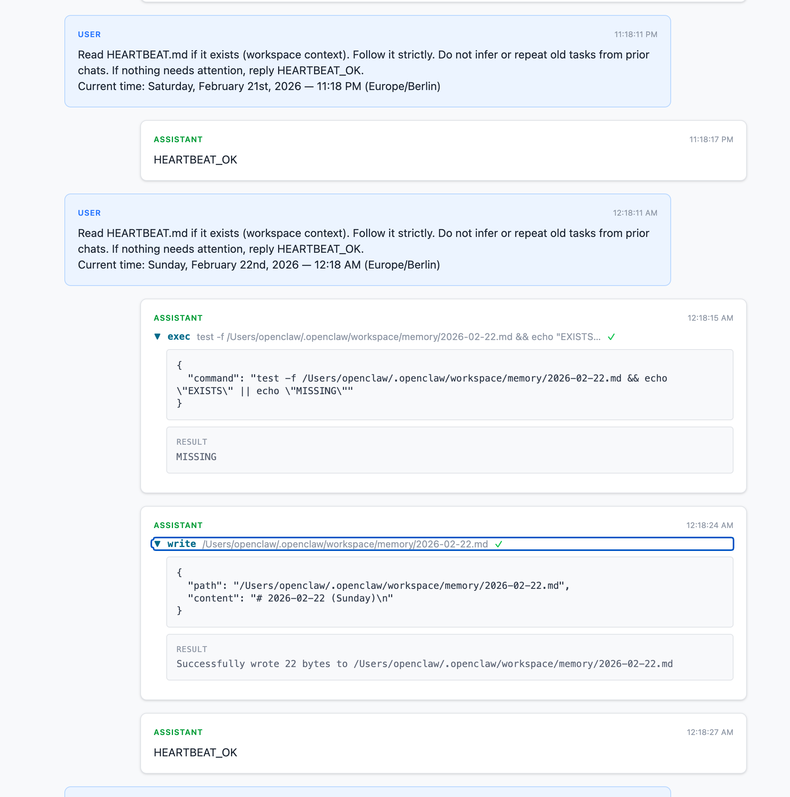

# pano

A local web app to browse [OpenClaw](https://github.com/openclaw/openclaw) session logs. View conversation timelines, tool calls, thinking blocks, and token usage from JSONL session files.

> **Note:** This project is published as-is and is not actively maintained. Issues and PRs are welcome but may not get a response.



## Features

- Browse sessions by agent
- Conversation timeline with user/assistant message bubbles
- Expandable thinking blocks (collapsed by default)
- Expandable tool calls with arguments and results
- Per-message token usage badges (input/output/cache)
- Session cost totals in USD

## Setup

```bash
npm install
npm run dev
```

This starts the Express API (port 3800) and Vite dev server (port 5173).

By default, pano reads session files from `~/.openclaw/agents/`. Override with:

```bash
AGENTS_DIR=/path/to/agents npm run dev
```

## Docker

```bash
docker compose up -d
```

This mounts `~/.openclaw/agents/` read-only and serves on port 3800.

## Stack

- **Frontend:** React 19 + TypeScript + Tailwind CSS v4 (Vite)
- **Backend:** Express 5 serving session data as JSON

## API

- `GET /api/agents` — List agent directories
- `GET /api/agents/:agent/sessions` — List sessions with timestamps and message counts
- `GET /api/agents/:agent/sessions/:id` — Full parsed JSONL session

## License

MIT
